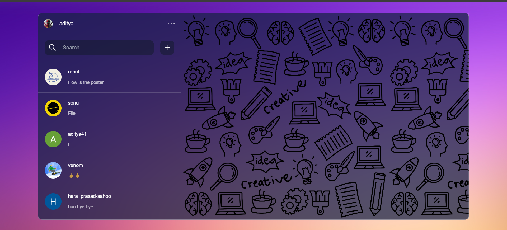
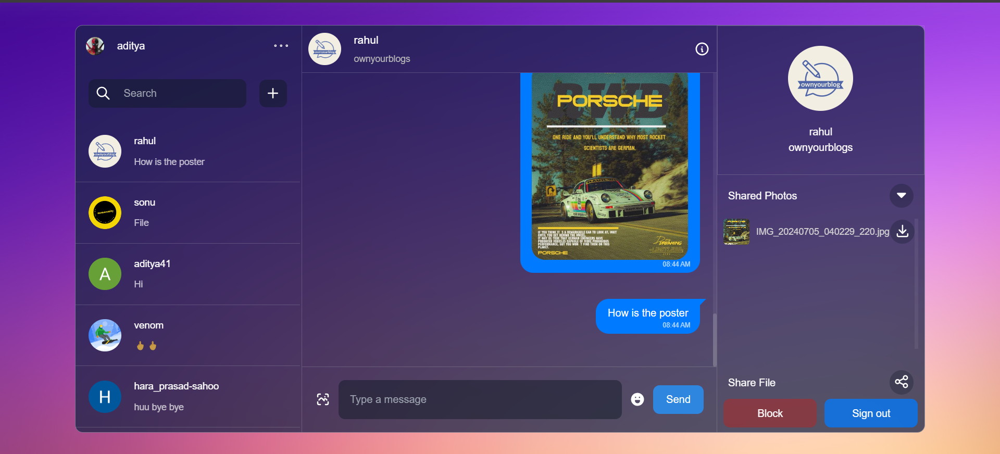

# Chat-Cat Realtime Chatting Application

## Table of Contents

- [Introduction](#introduction)
- [Features](#features)
- [Screenshots](#screenshots)
- [Technologies Used](#technologies-used)
- [Getting Started](#getting-started)
  - [Prerequisites](#prerequisites)
  - [Frontend Setup](#frontend-setup)
  - [Backend Setup](#backend-setup)
  - [Running the App](#running-the-app)
- [Firebase Setup](#firebase-setup)
- [Clerk Authentication Setup](#clerk-authentication-setup)
- [ngrok Setup](#ngrok-setup)
- [Contributing](#contributing)
- [License](#license)
- [Footer](#footer)

## Introduction

Chat-Cat is a real-time chat application built with React and Firebase. The application supports user authentication via Clerk and enables real-time messaging between users. The backend is powered by Firebase, which handles data storage, user authentication, and real-time updates.

## Features

- User authentication with Clerk
- Real-time messaging with Firebase
- Search for users
- Add and remove users from the chat list
- Responsive design

## Screenshots




## Technologies Used

- React
- Firebase (Firestore)
- Clerk (Authentication)
- CSS
- React Icons

## Getting Started

### Prerequisites

- Node.js and npm installed
- Firebase account and project setup
- Clerk account
- ngrok account

### Firebase Setup

#### Initialize Firebase for Frontend

```javascript
import { initializeApp } from "firebase/app";
import { getAuth } from "firebase/auth";
import { getFirestore } from "firebase/firestore";
import { getStorage } from "firebase/storage";

const firebaseConfig = {
  apiKey: import.meta.env.VITE_API_KEY,
  authDomain: "chat.firebaseapp.com",
  projectId: "chatcat-id",
  storageBucket: "chat.appspot.com",
  messagingSenderId: "98491654651",
  appId: "2:98491654651:web:9c5c460f8582ff5fa1c752",
};

// Initialize Firebase
const app = initializeApp(firebaseConfig);

export const auth = getAuth();
export const db = getFirestore();
export const storage = getStorage();
```

#### Initialize Firebase for Backend

```javascript
const admin = require("firebase-admin");
admin.initializeApp({
  credential: admin.credential.cert(
    require(process.env.GOOGLE_APPLICATION_CREDENTIALS)
  ),
});
const db = admin.firestore();
```

### Clerk Setup

1. Create an account on Clerk.
2. Create a local environment file and add your Firebase and Clerk API keys:
   ```env
   VITE_CLERK_PUBLISHABLE_KEY=CLERK_API_KEY_HERE
   VITE_API_KEY=FIREBASE_API_KEY_HERE
   ```
3. Go to the Clerk dashboard, navigate to webhooks, and create an endpoint with the ngrok URL.

### Setup ngrok

1. Visit [ngrok](https://ngrok.com/).
2. Install ngrok according to your operating system and open it.
3. Run the following script:
   ```sh
   ngrok http --domain=yak-included-currently.ngrok-free PORT
   ```

### Frontend Setup

1. Clone the repository:
   ```sh
   git clone https://github.com/AdityaKumar41/Chat-Cat.git
   cd Chat-Cat
   ```
2. Install dependencies:
   ```sh
   npm install
   ```

### Backend Setup

1. Install backend dependencies:
   ```sh
   cd ./backend
   npm install
   ```

### Running the App

1. Start the frontend server:
   ```sh
   npm run dev
   ```
2. Start the backend server:
   ```sh
   cd ./backend
   npm start
   ```

## Contributing

Contributions are welcome! Please feel free to submit a Pull Request.

## License

This project is licensed under the MIT License. See the [LICENSE](./LICENSE) file for details.

For more information, you can follow me on [Twitter](https://x.com/aditya_kumar_48).

---

© 2024 Chat-Cat. All rights reserved.
